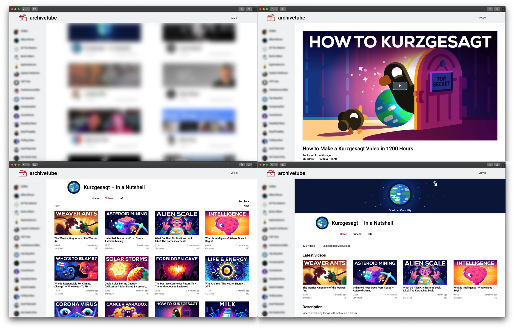

archivetube
==========

archivetube is a web GUI and server for archives created with [ytarchiver](https://github.com/alexmerkel/ytarchiver). It consists of a Flask-based
backend and a frontend with much of the functionalities of a typical video hosting platform.



**Important:** This is in no way meant as a production server. The backend is not optimized, there is no load balancing, and the video files are
served directly from disk without any re-encoding. The server is meant to run locally or in a private network with very limited users.

Usage
-----
```
$ archivetube.py DIR
```
where `DIR` is the directory in which to store the main database.
Additionally, the locations of the _ytarchiver_ archives have to be added to the database once. This can be either done individually by calling

```
$ archivetube.py -f ARCHIVEDIR DIR
```

for each `ARCHIVEDIR` that should be added or, if multiple archives are in a subdirectory of a `PARENTDIR`, by calling

```
$ archivetube.py -r -f PARENTDIR DIR
```

In both cases, `DIR` refers to the directory that contains (or will contain) _archivetube_'s main database (`tube.db`).

Requirements
------------

*   [python3](https://www.python.org/)
*   [Flask](https://pypi.org/project/Flask/)
*   [waitress](https://pypi.org/project/waitress/)
*   [Pillow](https://pypi.org/project/Pillow/)
*   [pycountry](https://pypi.org/project/pycountry/)

License
-------

**MIT**

Included projects:

*   [Video.js](https://videojs.com/) _Brightcove, Inc._ Apache License Version 2.0
*   [Roboto](https://github.com/googlefonts/roboto) _Christian Robertson_ Apache License Version 2.0
*   [FontAwesome](https://fontawesome.com/) _Dave Gandy_ SIL OFL 1.1
*   Artwork in the screenshots courtesy of [Kurzgesagt](https://kurzgesagt.org/)
